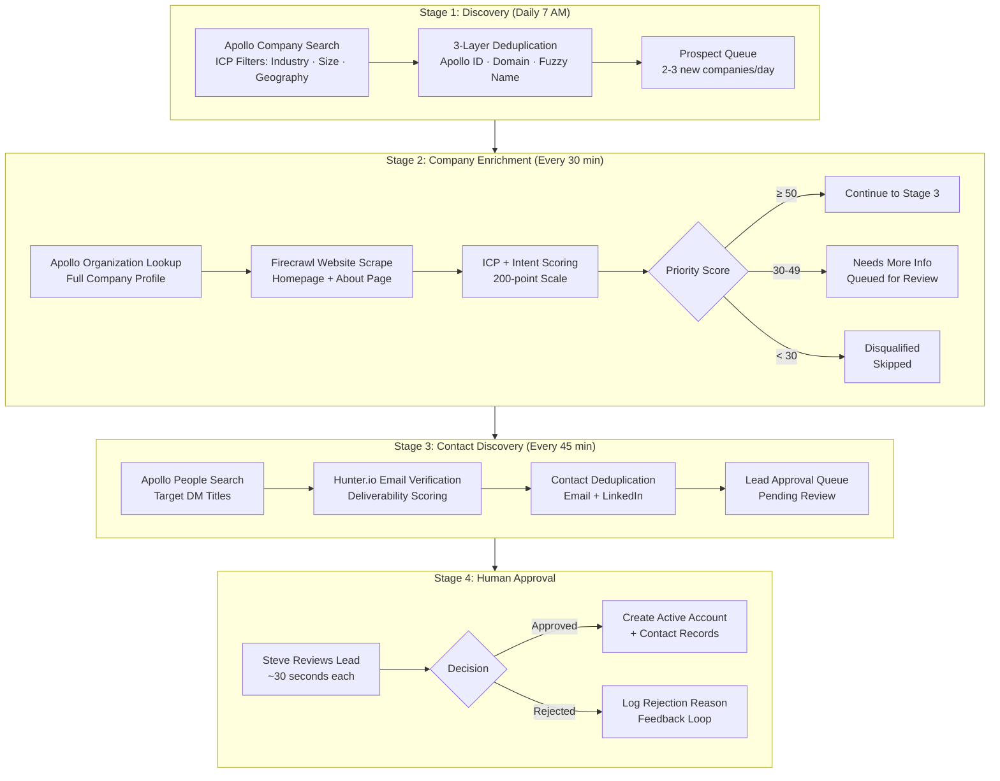

# Lead Generation & Enrichment Pipeline

**Four-stage automated pipeline that discovers, enriches, and qualifies 50+ leads per batch with zero manual data entry.**

## The Problem

Manual prospecting was eating 5+ hours per week with inconsistent results. The process looked like this: search LinkedIn or Google for companies that might need industrial networking equipment, copy their info into a spreadsheet, research each one individually, try to find the right person to contact, guess at their email, and manually enter everything into the CRM. Leads would sit in a spreadsheet for days before getting worked.

The data quality was unreliable. Some entries had full company profiles. Others had a name and a website. Decision maker information was spotty — sometimes I'd find the IT Director, sometimes I'd be cold-calling the main office line. And there was no consistent way to score which leads were actually worth pursuing first.

I needed a system that could discover prospects matching my ideal customer profile, enrich them with real company data, find the right people to talk to, and deliver everything pre-scored and ready to work — without me touching a spreadsheet.

## My Approach

I built a six-workflow pipeline in n8n that runs autonomously every day. Each stage handles one step of the prospecting process, with quality gates between stages to prevent garbage from flowing downstream. A human approval step sits between the automation and the active sales pipeline, so nothing enters the CRM without my review.

### Pipeline Architecture

### Stage 1: Discovery Engine

A scheduled workflow fires every weekday at 7 AM and searches Apollo for companies matching my ideal customer profile. The filters target the Southeast US (Alabama, Georgia, Florida, Tennessee, the Carolinas, Mississippi), company sizes of 50-500 employees, and 45+ industry keywords covering automotive manufacturing, food and beverage, fleet management, utilities, and MSP/integrator channels.

Before adding any prospect to the queue, the system runs a three-layer deduplication check: Apollo ID (exact match), normalized domain (strips http/www), and fuzzy company name matching against both the prospect queue and the active CRM. This prevents the same company from entering the pipeline twice, even if Apollo returns it with slightly different formatting.

Output: 2-3 unique, deduplicated prospects queued per day.

### Stage 2: Company Enrichment

Every 30 minutes, this workflow picks up pending prospects and enriches them from two sources:

- **Apollo Organization Lookup** — full company profile (industry, employee count, revenue, LinkedIn, founding year)
- **Firecrawl Website Scrape** — extracts the company's homepage and about page as markdown for keyword analysis

The enriched data feeds into a dual scoring algorithm that evaluates both fit and timing.

### Stage 3: Contact Discovery

For companies that clear the scoring threshold, this stage finds decision makers using Apollo's People Search (targeting titles like Director of IT, VP Operations, Network Engineer, Fleet Manager) and verifies their email addresses through Hunter.io's domain search.

Contacts are deduplicated by email and LinkedIn URL, then packaged with the full company profile into the approval queue.

### Stage 4: Human Approval

This is the critical gate. Every lead lands in a staging table in NocoDB — not the active pipeline. I get a daily email at 9 AM showing how many leads are pending, broken down by tier (Gold, Silver, Bronze), with a preview of the top 3 by priority score.

Review takes about 30 seconds per lead: check the industry fit, verify the location is in my territory, scan the research quality, and look at the decision makers found. Approved leads get automatically promoted to Active Accounts with linked contact records created. Rejected leads log a reason (Wrong Industry, Out of Territory, Company Too Small, etc.) that feeds back into scoring refinement.

## The Scoring System

Every prospect gets two independent scores that combine into a final priority ranking.

### ICP Score (How well do they fit?)

| Component | Max Points | What It Measures |
| --------- | ---------- | ---------------- |
| Industry Fit | 25 | Transport/Fleet/Utilities = 25, Manufacturing = 22 |
| Company Size | 20 | 50-500 employees (sweet spot) = 20 |
| Revenue | 20 | $10M-$100M = 20 |
| Geography | 15 | Target states in Southeast US = 15 |
| Tech Signals | 20 | Website mentions IoT, cellular, 4G/5G, remote monitoring (4 pts each) |

### Intent Score (Are they likely to buy now?)

| Signal | Max Points | What Triggers It |
| ------ | ---------- | ---------------- |
| Competitor Presence | 35 | Website mentions Cradlepoint, Peplink, Sierra Wireless |
| Hiring Signals | 25 | Job postings for Network Engineer, IT Director, Fleet Manager |
| Growth Signals | 20 | Website mentions expansion, new facilities, acquisitions |
| Website Keywords | 20 | Cellular connectivity, fleet tracking, failover, WAN |

**Priority Score** = (ICP x 0.6) + (Intent x 0.4)

The 60/40 weighting favors fit over timing — a company that's a perfect match for our products but not actively buying right now is still more valuable than a poor-fit company showing intent signals. The intent score helps prioritize within a tier.

### VIP Tier Assignment

| Tier | Priority Score | What Happens |
| ---- | -------------- | ------------ |
| **Gold** | 80-100 | Immediate email alert, fast-track approval |
| **Silver** | 60-79 | Daily email digest |
| **Bronze** | 40-59 | Weekly summary |
| **Disqualified** | < 40 | Skipped entirely |

## How It Works End-to-End

A typical day:

1. **7:00 AM** — Discovery engine runs, finds 2-3 new prospects from Apollo
2. **7:30 AM** — Enrichment pipeline scores them (ICP + Intent), scrapes their websites
3. **8:15 AM** — Contact enrichment finds decision makers, verifies emails
4. **9:00 AM** — I get an email: "3 leads ready for review: 1 Gold, 2 Silver"
5. **9:05 AM** — I open the approval queue, review all 3 in under 2 minutes, approve 2
6. **9:15 AM** — Approval processor creates Active Account records + linked contacts
7. **9:30 AM** — New accounts are ready for outreach with pre-scored profiles and verified contacts

Total time from discovery to CRM-ready: **~2 hours, fully automated.** My involvement: **~2 minutes of review.**

## Tech Stack

| Component | Role |
| --------- | ---- |
| **n8n** | Workflow orchestration — 6 workflows handling discovery, enrichment, approval, and sync |
| **Apollo.io** | Company search and people search — prospect discovery and decision maker identification |
| **Firecrawl** | Website scraping — extracts page content as markdown for keyword analysis |
| **Hunter.io** | Email verification — domain search with deliverability confidence scoring |
| **NocoDB** | CRM tables — Prospect Queue, Lead Approval Queue, Active Accounts, Contacts |
| **Supabase** | Vector database — pgvector embeddings for semantic search across prospect data |
| **HuggingFace** | Embedding models — generates vector representations for RAG-powered personalization |
| **Claude AI** | Research analysis — generates company summaries and identifies selling angles |

## Results

| Metric | Before | After |
| ------ | ------ | ----- |
| Weekly prospecting hours | 5+ hours | ~10 min (review only) |
| Leads processed per batch | 3-5 (manual) | 50+ (automated) |
| Data consistency | Varies widely | Standardized scoring on every lead |
| Decision maker identification | Hit-or-miss | Systematic search with email verification |
| Time from discovery to CRM | Days | ~2 hours |
| Lead quality control | None (everything entered) | Scored, gated, and human-approved |
| Duplicate accounts | Frequent | Zero (3-layer deduplication) |

## What I'd Do Differently

**Start with the scoring model, not the data pipeline.** I built the discovery and enrichment stages first, then added scoring later. But the scoring logic is what makes the whole system useful — without it, you're just automating the creation of a messy spreadsheet. If I were starting over, I'd define the ICP and Intent criteria first, then build the pipeline to feed them.

**Add the human approval gate from day one.** The first version pushed leads directly into the active pipeline. Within a week I had 30+ low-quality accounts cluttering my CRM. The approval queue added less than 2 minutes of daily overhead and completely solved the quality problem. Every automated pipeline that touches a CRM should have a human gate.
