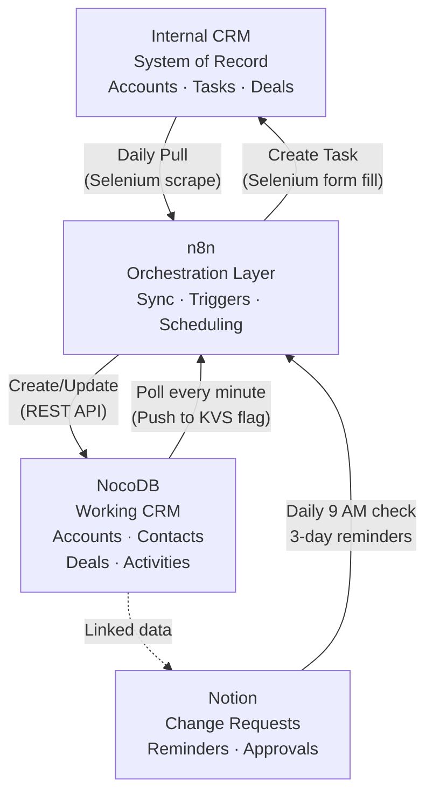
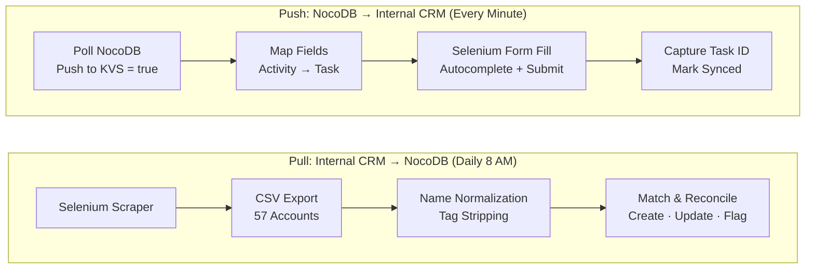
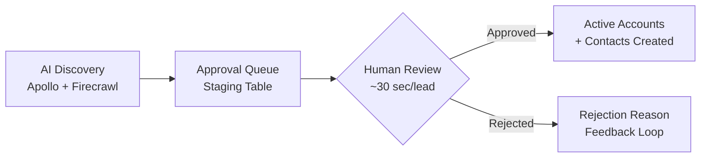

# NocoDB CRM + Multi-System Orchestration

**Self-hosted CRM with bidirectional sync across four enterprise systems — zero licensing cost.**

## The Problem

My company's internal CRM has no API, no automation capabilities, and a session timeout that expires every five minutes. It's a web-based system built for manual data entry, not integration. But it's the system of record — management reviews happen there, pipeline reports come from there, and every client task has to live there.

Meanwhile, I needed things the internal CRM couldn't do: automated follow-up tracking, pipeline stage management, contact relationship mapping, integration with Notion for change requests, and a way to trigger n8n workflows based on data changes. I could have asked for Salesforce. But Salesforce is expensive, slow to customize, and overkill for a territory of 57 accounts.

I needed a lightweight, self-hosted CRM that could sit alongside the internal system, stay in sync with it, and serve as the automation layer the internal CRM was never built to be.

## My Approach

I deployed NocoDB as the primary working CRM and built a bidirectional sync layer that keeps it in lockstep with the internal system. The key constraint: the internal CRM has no API, so all interaction happens through browser automation.

### The Four Systems

### Bidirectional Sync

The sync runs in two directions with clear ownership rules:

**Pull (Internal CRM → NocoDB):** A daily scheduled workflow scrapes the internal CRM's client list and deals pipeline through Selenium browser automation, exports to CSV, then reconciles against NocoDB records. Name normalization strips distributor tags and corporate suffixes before matching, so "Data Activation Center &lt;All Ways Wireless&gt;" correctly matches "Data Activation Center" without creating duplicates.

**Push (NocoDB → Internal CRM):** When I log a sales activity in NocoDB and flag it for sync, an n8n workflow detects the change within one minute, maps the data to the internal CRM's form fields, and uses Selenium to fill out and submit the task creation form — including autocomplete fields that require typing, waiting for a dropdown, and selecting the right match.

### Name Normalization & Deduplication

This was the hardest technical problem. The internal CRM appends distributor tags to company names as metadata (e.g., "Company Name &lt;Distributor&gt;"), and these tags change over time as distributor relationships evolve. A naive string comparison would create duplicates every time a tag was added or removed.

The solution is a multi-step normalization pipeline:

1. **Strip distributor tags** — regex removes `<anything>` patterns
2. **Strip product codes** — removes suffixes like `(RUT)`, `(TRB)` appended by the CRM
3. **Remove corporate suffixes** — handles 15+ patterns (Inc., LLC, Corp., Ltd., GmbH, S.A., etc.)
4. **Normalize spacing and punctuation** — consistent comparison surface
5. **Fuzzy matching fallback** — token-sort ratio matching for edge cases where formatting differs but the company is the same

The system preserves the full name with tags in NocoDB for reference, but always matches on the normalized form. When a distributor tag changes, the account updates cleanly instead of duplicating.

### Notion Integration

Sales change requests (VIP tier changes, account reassignments) go through a Notion database. An n8n workflow checks daily at 9 AM for pending requests and sends email reminders every 3 days until the manager responds. This replaced a process where requests would sit in someone's inbox and get forgotten.

### Lead Approval Queue

AI-generated prospects don't go directly into the active pipeline. They land in a staging table with quality gates — Priority Score >= 50, ICP Score >= 40, minimum 2 decision makers identified. A daily review takes about 30 seconds per lead: check industry fit, location, research quality, make a decision. Only approved leads get promoted to Active Accounts with contacts auto-created.

## How It Works

### Database Schema

NocoDB serves as the working CRM with four core tables:

| Table | Records | Purpose |
| ----- | ------- | ------- |
| **Active Accounts** | 51+ | Pipeline tracking, research notes, VIP scoring, sync status |
| **Contacts** | 141+ | Decision makers, email/phone, linked to accounts |
| **Deals** | Varies | Indirect sales pipeline with win probability and deal values |
| **Lead Approval Queue** | Batch | Staging area for AI-generated prospects before pipeline entry |

### Browser Automation Architecture

Since the internal CRM has no API, all reads and writes go through a persistent Chrome session with remote debugging enabled. The browser stays logged in indefinitely (surviving sleep/wake cycles), and scripts connect to it via Selenium's debugger address. This avoids the session timeout problem entirely — no cookie management, no re-authentication.

**Scraping** uses BeautifulSoup to parse the internal CRM's Material-UI data tables. Critical detail: client names are extracted from the `<a title="">` attribute, not the link text, because the CRM truncates display text with ellipsis. Currency values use European formatting ("332,05 EUR") and get parsed into standard decimals.

**Form filling** handles autocomplete inputs by typing the company name, waiting for the dropdown to render, then sending keyboard events (arrow down + enter) to select the match. A hidden field validation confirms the correct record was selected before submission.

### Sync Reliability

- **Duplicate prevention:** Every synced record carries the internal CRM's task ID. The workflow checks for existing IDs before creating.
- **Append-only notes:** Status notes are never overwritten — new information is appended with a date stamp, preserving the full history.
- **Failure handling:** Failed syncs stay in the queue for retry. The NocoDB record keeps a sync status and error message field for debugging.
- **Disposition tracking:** When accounts are removed from the internal CRM, the sync prompts for a reason (disqualified, re-engage later, transferred) rather than silently deleting.

## Tech Stack

| Component | Role |
| --------- | ---- |
| **NocoDB** | Self-hosted CRM — accounts, contacts, deals, approval queue |
| **n8n** | Workflow orchestration — scheduling, polling, data transformation |
| **Python** | Sync scripts — scraping, normalization, reconciliation |
| **Selenium** | Browser automation — reads and writes to the internal CRM |
| **BeautifulSoup** | HTML parsing — extracts structured data from CRM tables |
| **Notion API** | Change request tracking with automated reminder escalation |
| **PostgreSQL** | NocoDB backend storage |
| **rapidfuzz** | Fuzzy string matching for account deduplication |

## Results

| Metric | Before | After |
| ------ | ------ | ----- |
| Account sync coverage | Manual, partial | 57/57 (100%) |
| CRM licensing cost | $0 (no automation possible) | $0 (full automation) |
| Activity logging | Manual entry in internal CRM | Log once in NocoDB, syncs within 1 min |
| Change request follow-up | Email reminders (manual) | Automated 3-day escalation |
| Lead qualification | Manual research + data entry | Staged approval with quality gates |
| Duplicate accounts | Recurring problem | Zero (name normalization) |
| Data entry per account sync | ~5 min manual | Fully automated |

## What I'd Do Differently

**Build the name normalization library first.** I spent more time debugging duplicate accounts than any other single issue. Distributor tags, corporate suffixes, truncated display names, European character encoding — every edge case created phantom duplicates. A robust matching library up front would have saved weeks of cleanup.

**Design for bidirectional sync from day one.** I started with a one-way pull (internal CRM → NocoDB) and added the push direction later. The data ownership rules — which system is authoritative for which fields — should have been defined before writing any sync code. Retrofitting that distinction was messier than it needed to be.
