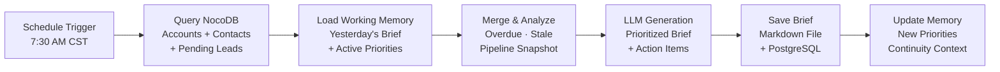
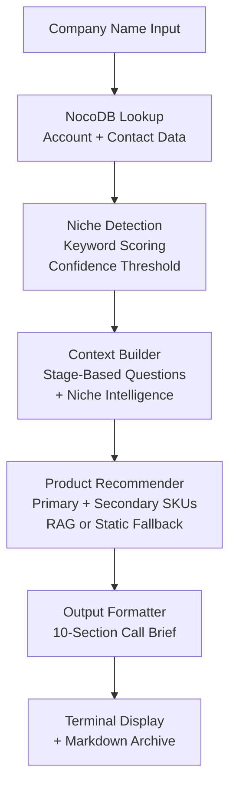
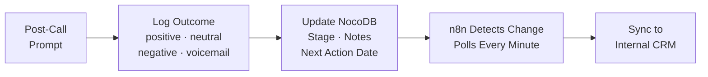

# Nightly Sales Prep Pipeline

**Cut daily sales call preparation from 45 minutes to under 5.**

## The Problem

As a B2B sales rep managing 50+ industrial IoT accounts across multiple verticals — automotive suppliers, food and beverage manufacturers, MSPs — I was spending 30-45 minutes every morning on the same routine: pull up the CRM, check who's due for follow-up, review their last conversation notes, figure out what products to recommend, and mentally rehearse what to say.

That's 3+ hours per week of prep time that doesn't generate revenue. Worse, the quality was inconsistent. On busy mornings I'd skip the research and wing it. On slow mornings I'd over-prepare for one account and neglect others. There was no system.

I needed something that could look at my entire pipeline, figure out who I should call today, and hand me a brief that's actually useful — not a CRM dump, but a structured call plan with the right questions for that specific prospect's industry and stage.

## My Approach

I built a two-part system: an **automated daily briefing** that runs every morning before I wake up, and an **on-demand call prep agent** I can invoke for any account at any time.

### Daily Brief (n8n Workflow)

A scheduled n8n workflow fires at 7:30 AM every weekday. It pulls data from three sources — active accounts, contacts due for follow-up, and pending leads in the approval queue — then feeds everything to an LLM that generates a prioritized daily action plan.

The brief isn't just a list of names. It includes a pipeline snapshot, the top 3 priority accounts with reasoning ("Gold tier, 8 days overdue, decision maker identified"), stale account alerts, and specific action items. Each item carries over day-to-day through a working memory system, so nothing falls through the cracks.

### On-Demand Call Prep Agent (Python CLI)

For any specific account, I run `call_prep_agent.py "Company Name"` and get a 10-section call brief in my terminal within seconds.

The key innovation is **niche detection with confidence scoring**. The agent analyzes the account's segment and research notes, scores keywords against five industry profiles (Automotive Supplier, Food & Beverage, Manufacturing, MSP/Integrator, General Industrial), and returns a niche classification with a confidence value. If confidence is below 0.3, it falls back to a general profile rather than guessing wrong.

That niche drives everything downstream: which pain points to probe, which discovery questions to ask, which products to recommend, and how to frame the value proposition.

### Post-Call Workflow

After the call, `call_prep_agent.py --post-call "Company Name"` walks me through logging the outcome. It asks for the call result, captures notes, suggests the next pipeline stage based on the current one, and updates the CRM. A separate n8n workflow detects the change within one minute and syncs it back to the company's internal CRM automatically.

## How the Call Brief Works

The agent generates a structured 10-section brief tailored to each call:

| Section | What It Contains |
|---------|-----------------|
| **Contact Summary** | Name, title, phone, email, LinkedIn, decision-maker status |
| **Account Overview** | Industry, size, location, pipeline stage, VIP tier, niche classification |
| **Recent Activity** | Last contact date (with days elapsed), status notes, next action |
| **Company Intelligence** | Research summary + niche-specific pain points |
| **Discovery Questions** | 5-7 prioritized questions based on stage + niche |
| **Product Recommendations** | Primary and secondary products with use cases |
| **Value Propositions** | Niche-specific differentiators |
| **Objection Handling** | Common objections with prepared responses |
| **Call Structure** | Scripted opener → discovery → value prop → close |
| **Success Metrics** | What outcome advances to the next pipeline stage |

### Niche-Aware Intelligence

The system maintains a niche intelligence library with five industry profiles. Each profile contains pain points, discovery questions, product recommendations, value propositions, and objection responses specific to that vertical.

For example, an automotive supplier gets questions about OEM plant relationships and JIT manufacturing connectivity, while an MSP gets questions about client standardization and multi-site management complexity.

### Stage-Aware Discovery

Questions adapt based on where the prospect sits in the pipeline:

- **Cold outreach (stages 0-1):** Broad pain point discovery, rapport building
- **Interested (stage 2):** Technical qualification, sample commitment
- **Testing (stage 3):** Address technical concerns, pilot scoping
- **Negotiations (stages 4-5):** Pricing, procurement process, timeline

## Tech Stack

| Component | Role |
|-----------|------|
| **n8n** | Workflow orchestration — daily brief scheduling, data aggregation, CRM sync |
| **Python** | Call prep agent CLI — niche detection, context building, output formatting |
| **NocoDB** | Primary CRM — accounts, contacts, pipeline tracking |
| **PostgreSQL** | Working memory persistence — daily briefs, action items, continuity context |
| **Gemini 2.0 Flash** | Daily brief generation — prioritized action plans from pipeline data |
| **Claude AI** | On-demand research enrichment and analysis |
| **Selenium** | Browser automation for internal CRM sync (no API available) |

## Results

| Metric | Before | After |
|--------|--------|-------|
| Morning prep time | 30-45 min/day | ~5 min/day |
| Weekly prep hours | 3+ hours | <30 min |
| Call prep consistency | Varies by day | Structured brief every time |
| Pipeline visibility | Manual CRM checks | Automated daily snapshot |
| Post-call CRM updates | Manual, often delayed | Logged immediately, synced within 1 min |
| Account coverage | Top-of-mind only | Priority-ranked across full pipeline |

## What I'd Do Differently

**Start with the daily brief, not the call prep agent.** I built the on-demand agent first, then realized I still needed something to tell me *who* to call. The daily brief solved that, and now the two systems complement each other — the brief sets the agenda, the agent handles the details.

**Invest in the niche intelligence library earlier.** The generic version of this system was useful but not compelling. The moment I added industry-specific pain points and discovery questions, call quality jumped noticeably. Domain knowledge is the difference between "another sales automation tool" and something that actually changes how you sell.
